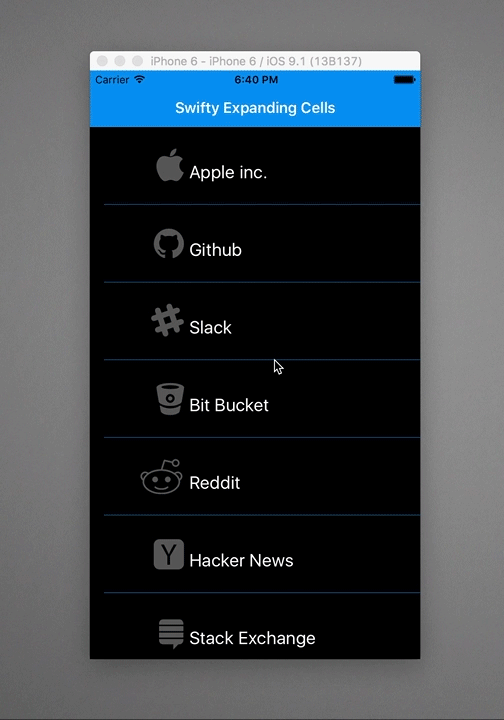

# Swifty Expanding Cells - Swift 4 Xcode 9

Inspired by Google Inbox. Example Swift 2.2 Xcode 7.3 project which demonstrates the use of a custom UIViewController transition of an expanding UITableView cell effect while pushing a new item on to the navigation stack. Popping the item back off the UINavigationController reverses the exploding UITableViewCell effect.
